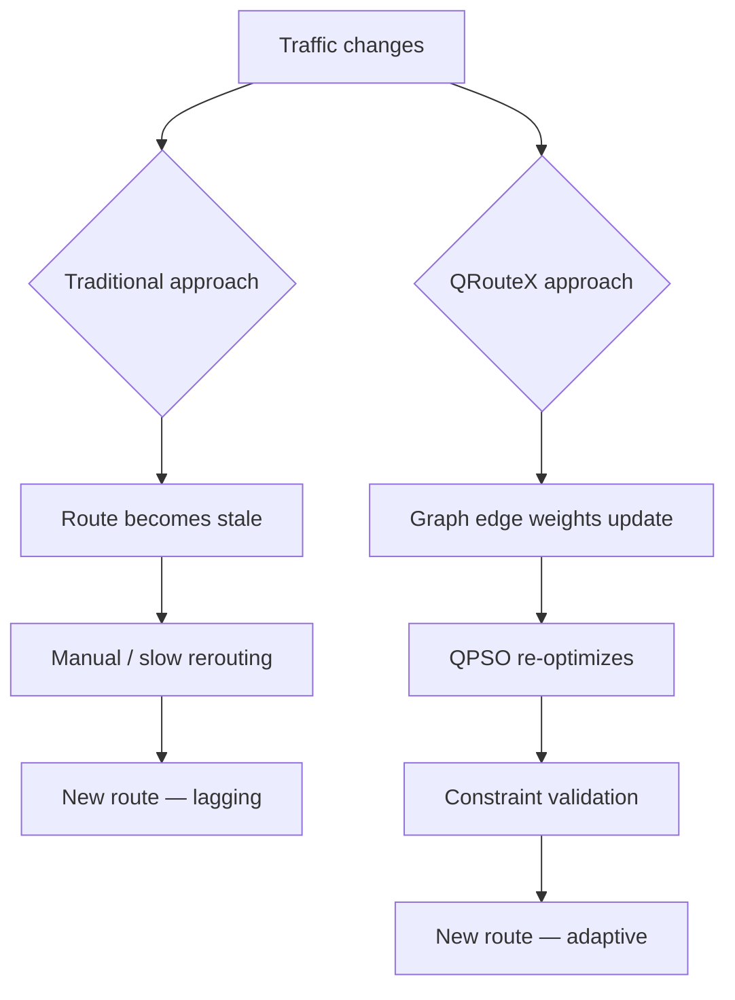
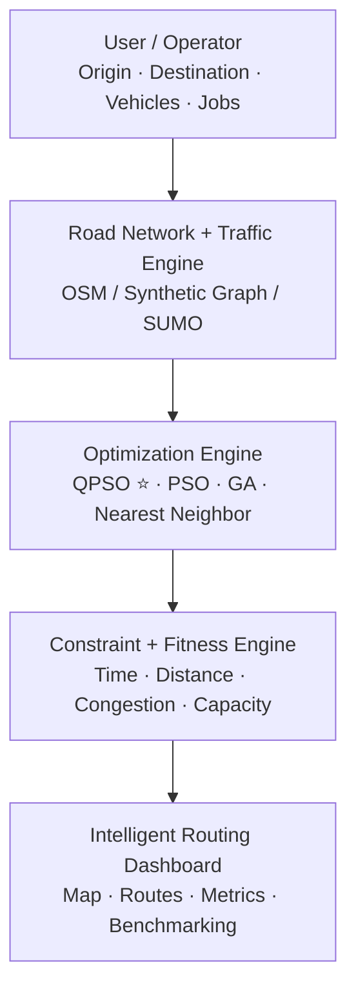
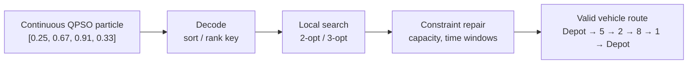

# QRouteX

### Quantum-Inspired Intelligent Traffic Route Optimization in Transportation Systems Using Metaheuristic Optimization

**SIH 2026** · Problem Statement ID **261437** · Theme: **Transportation & Logistics** · Category: **Software**

> "Beyond the shortest path — QRouteX continuously searches for the most efficient route as traffic conditions change."

---

## Overview

QRouteX is a fleet-routing optimization system for **logistics and delivery companies** — not a consumer navigation app. Given a fleet of vehicles, a set of delivery stops, vehicle capacities, and current traffic conditions, it computes near-optimal multi-vehicle routes using a **quantum-inspired metaheuristic (QPSO)**, benchmarks that result honestly against classical alternatives (PSO, Genetic Algorithm, Nearest Neighbor), and re-optimizes automatically as traffic conditions change.

This isn't "Google Maps with QPSO." Google Maps and Google's Route Optimization API already solve consumer/fleet navigation well in production. QRouteX's contribution is the **optimization method itself** — a discrete-VRP-adapted quantum-inspired algorithm, an AHP-derived objective, a fair-benchmarking methodology with real statistical significance testing, and a working prototype validated against a real SUMO traffic simulation.

**Direct users:** logistics/delivery fleet operators, smart-city traffic authorities.
**Indirect beneficiaries** (never touch the system): citizens, emergency services, the environment — through reduced congestion and emissions.

---

## The Problem

Modern fleet routing is a **Vehicle Routing Problem (VRP)**: multiple vehicles, multiple delivery stops, vehicle capacity limits, and traffic conditions that change throughout the day. A single-vehicle shortest path is trivial (Dijkstra/A\*); a multi-vehicle problem with capacity constraints and dynamic traffic is **NP-hard** — exact methods don't scale, so a good metaheuristic that finds near-optimal solutions quickly is required, along with rigorous proof that it outperforms conventional approaches.



---

## Our Solution — Five-Layer Architecture



### Four innovation pillars

1. **Traffic-Adaptive Intelligent Routing (TAIR)** — routes selected using current traffic and road conditions, not static distance alone.
2. **Multi-Vehicle Optimization via QPSO** — quantum-inspired particle swarm optimization finds near-optimal routes across the whole fleet at once.
3. **Multi-Objective Route Planning** — simultaneously balances travel time, distance, and congestion in one fitness function.
4. **Dynamic Re-Routing** — routes automatically recalculate when traffic, accidents, or road closures change conditions.

---

## Mathematical Formulation

**Objective function:**

$$F = w_1 T_{total} + w_2 D_{total} + w_3 C_{total}$$

**Dynamic traffic-aware edge weight:**

$$W_{ij}(t) = \alpha D_{ij} + \beta T_{ij}(t) + \gamma C_{ij}(t)$$

**Key constraints:** vehicle capacity, delivery time windows, each customer visited exactly once, every route starts/ends at the depot, sub-tour elimination.

### Objective weights — AHP-derived, not arbitrary

The weights `w1` (time), `w2` (distance), `w3` (congestion) were derived using the **Analytic Hierarchy Process (AHP)** — a documented pairwise comparison, not a guess:

| Criterion | Weight |
|---|---|
| Travel Time | 0.5714 |
| Distance | 0.2857 |
| Congestion | 0.1429 |

Consistency Ratio = 0.00 (fully consistent). See [`ahp_weights.py`](./benchmark/ahp_weights.py).

---

## The Discrete-Encoding Challenge

QPSO naturally works with continuous values; a VRP route is discrete (`Depot → 5 → 2 → 8 → 1 → Depot`). QRouteX solves this with a decode → local-search → repair pipeline:



---

## Benchmarking — Fair Protocol, Honest Results

Every algorithm is run under **identical conditions**: same population size, same iteration budget, same problem instance, same seed schedule. Winners are only claimed when a two-sample **t-test gives p < 0.05** — not just by comparing means.

| Parameter | Value |
|---|---|
| Population size | 30 (identical across QPSO, PSO, GA) |
| Iterations | 150 |
| Independent runs | 30 |
| Instance sizes tested | 20 and 40 customer nodes |

### Results (30 runs, AHP weights)

**20-node instance:** QPSO ≈ GA (statistically tied, p = 0.14) — both significantly beat PSO (p < 0.001).
**40-node instance:** GA significantly outperforms both QPSO and PSO (p < 0.0001).

**Honest headline finding:** *QPSO and GA are statistically indistinguishable at smaller scale. As the problem grows, GA pulls significantly ahead — our continuous-key decode loses structural information at scale, a real limitation we report rather than hide.*

A sensitivity sweep across 6 different weight combinations confirms this is robust — QPSO and GA are tied in 5 of 6 weightings, not just the one we happened to pick.

---

## Real Traffic Validation — SUMO Simulation

Rather than relying on synthetic random congestion, QRouteX has been validated against a real **SUMO** (Simulation of Urban MObility) traffic simulation:

1. A real 6×6 grid road network (36 junctions, 120 edges) built with `netgenerate`
2. ~1,440 simulated background trips representing ordinary citizen traffic, routed with `duarouter`
3. A real simulation run producing **measured** congestion (`speedRelative`) and real vehicle counts per road segment
4. QRouteX's QPSO/PSO/GA algorithms run **unmodified** against this real, measured data

See [`sumo/`](./sumo) for the full reproducible pipeline (`run_pipeline.sh`).

---

## Repository Structure

```
qroutex/
├── core/
│   ├── vrp_core.py           # instance generation, traffic-aware graph, decode/repair, fitness
│   └── algorithms.py         # QPSO, PSO, GA, Nearest Neighbor baseline
├── benchmark/
│   ├── run_benchmark.py      # fair-benchmarking protocol (30 runs, significance testing)
│   ├── ahp_weights.py        # AHP pairwise comparison + eigenvector weight derivation
│   ├── sensitivity_analysis.py  # QPSO vs GA robustness across weight combinations
│   ├── demo_cli.py           # single-run CLI demo
│   └── results.json          # official measured results
├── backend/
│   ├── api.py                # FastAPI server exposing /api/instance and /api/optimize
│   ├── static/index.html     # dashboard frontend (calls the backend)
│   └── requirements.txt
├── dashboard_standalone/
│   └── qroutex_dashboard.html   # zero-dependency browser-only fallback demo
├── sumo/
│   ├── run_pipeline.sh       # regenerates network, traffic, simulation, and route from scratch
│   ├── network.net.xml       # real SUMO road network
│   ├── sumo_instance.py      # bridges real SUMO data into a QRouteX instance
│   └── visualize_sumo_route.py
└── docs/
    └── presentation/         # slide decks, speaker notes
```

---

## Tech Stack

| Layer | Technology |
|---|---|
| Core language | Python (NumPy) |
| Optimization | QPSO, PSO, GA (hand-implemented, validated) — Google OR-Tools planned as a fourth baseline |
| Road network | OSMnx (real-world) / SUMO `netgenerate` (synthetic grid) |
| Traffic simulation | SUMO (Eclipse SUMO / DLR) |
| Graph modeling | NetworkX |
| Backend API | FastAPI |
| Frontend | HTML/JS + Chart.js (dashboard), React + Leaflet/MapLibre (planned production frontend) |
| Data storage | PostgreSQL / SQLite (planned) |

---

## Getting Started

### Prerequisites

```bash
pip install numpy scipy fastapi uvicorn networkx
```

For the SUMO simulation pipeline:

```bash
sudo apt-get install sumo sumo-tools
export SUMO_HOME=/usr/share/sumo
```

### 1. Run the offline benchmark

```bash
cd benchmark
python3 run_benchmark.py
```

### 2. Run a single scenario from the CLI

```bash
python3 demo_cli.py --nodes 20 --algorithm all --runs 5 --hybrid
```

### 3. Launch the FastAPI backend + dashboard

```bash
cd backend
pip install -r requirements.txt
uvicorn api:app --reload --port 8000
```

Open **http://localhost:8000/** — the dashboard is served by the same app (no CORS setup needed).

### 4. Or run the standalone browser dashboard (zero dependencies)

Just open `dashboard_standalone/qroutex_dashboard.html` directly in any browser. Runs QPSO/PSO/GA entirely in JavaScript — useful as an offline fallback demo.

### 5. Run the real SUMO traffic simulation

```bash
cd sumo
bash run_pipeline.sh
```

Regenerates the road network, simulates background citizen traffic, measures real congestion, and runs QPSO against it end to end.

---

## Known Limitations (reported honestly)

- **Delivery demand is synthetic** (randomly generated per customer) — this is legitimately business data that should come from a real order-management system, not from traffic simulation.
- **The SUMO network is a synthetic 6×6 grid**, not a real city — swapping in OSMnx-derived real street data is a documented, drop-in extension.
- **No system-optimal / multi-fleet modeling yet** — the current objective optimizes one company's fleet against existing congestion; it doesn't yet model what happens if many fleets adopt this optimizer simultaneously (a known traffic-assignment problem).
- **QPSO's discrete encoding loses structure at scale** — the honest benchmarking result showing GA overtaking QPSO on larger instances.

## Roadmap

- [ ] Real OSM road network via OSMnx for a target city
- [ ] Google OR-Tools as a fourth benchmark baseline
- [ ] Improved decode strategy for larger instances (savings-based / cluster-first-route-second)
- [ ] System-optimal objective term accounting for shared road capacity across fleets
- [ ] Live traffic API integration (replacing SUMO's simulated background traffic)
- [ ] Extend benchmark to 60–100 node instances

---

## Team

| Member | Responsibility |
|---|---|
| M1 | QPSO / optimization algorithm |
| M2 | Mathematical modeling + benchmarking |
| M3 | OSM / graph / traffic simulation |
| M4 | Backend + APIs + database |
| M5 | Frontend + map dashboard |
| M6 | Integration + testing + presentation |

---

## References

- Sun, J., Feng, B., Xu, W. (2004). *Particle Swarm Optimization with Particles Having Quantum Behavior.* — QPSO
- Kennedy, J., Eberhart, R. (1995). *Particle Swarm Optimization.*
- Saaty, T. L. (1980). *The Analytic Hierarchy Process.*
- Eclipse SUMO — Simulation of Urban MObility, DLR: https://eclipse.dev/sumo/
- OSMnx: Boeing, G. (2017). *OSMnx: New methods for acquiring, constructing, analyzing, and visualizing complex street networks.*

---

## License

MIT License — see `LICENSE` for details.


# QRouteX — Core Prototype Code

## Python backend (offline benchmarking + CLI demo)
- `vrp_core.py` — instance generator, traffic-aware weighted graph, decode/repair, fitness
- `algorithms.py` — QPSO, PSO, GA (order-crossover), nearest-neighbor baseline
- `run_benchmark.py` — runs the full fair-benchmarking protocol (12 runs x 3 algos x 2 sizes), writes results.json
- `demo_cli.py` — single-run CLI: `python3 demo_cli.py --nodes 20 --algorithm all --runs 5 --hybrid`
- `results.json` — the real measured results already generated

## Browser dashboard
- `../qroutex_dashboard.html` — standalone interactive prototype (open directly in any browser, no server needed).
  Runs the same QPSO/PSO/GA logic live in JavaScript, lets you generate instances,
  tune population/iterations, toggle 2-opt hybridization, and see routes on a map +
  convergence chart + results table update in real time.

## Requirements
- Python backend: Python 3 + NumPy only
- Dashboard: any modern browser, internet connection for the Chart.js CDN script tag
  (swap in a local copy of Chart.js if presenting somewhere offline)

## To extend
- Increase INSTANCE_SIZES / N_RUNS in run_benchmark.py for a deeper study
- Swap generate_instance() for a real OSMnx-derived road network + SUMO traffic feed
- Add OR-Tools as a fourth baseline once environment allows installing it
